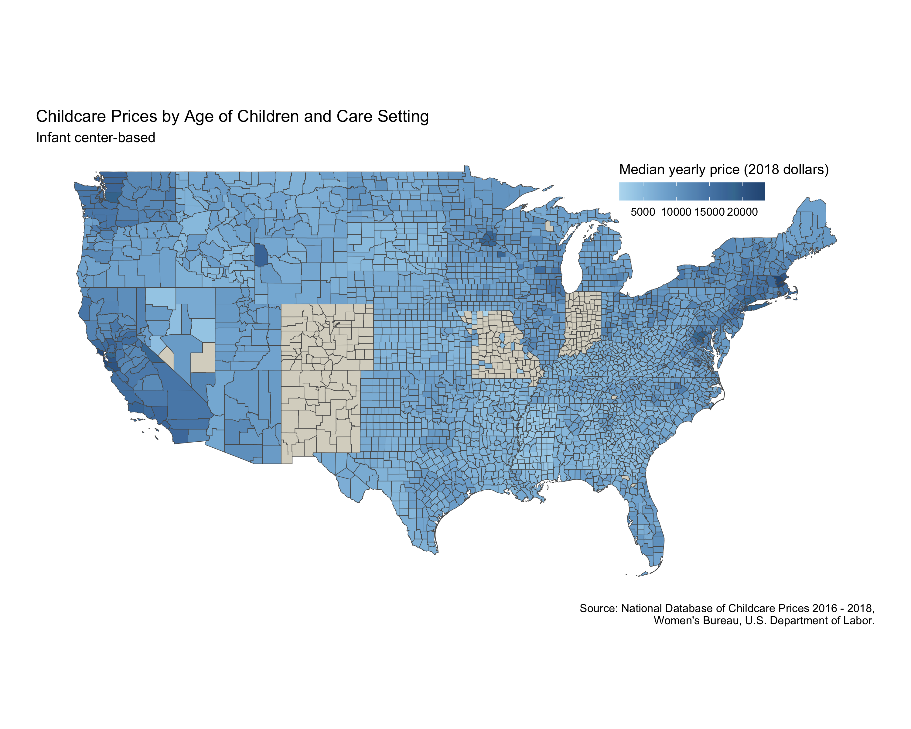

# tidy-tuesday

## 2023

### 20: Tornadoes

Code: [https://github.com/MHenderson/tt-tornadoes](https://github.com/MHenderson/tt-tornadoes)

![This image shows a grid of maps of the US state of Kentucky. Each map represents a different decade and is filled with coloured arrows showing the paths of tornadoes in that decade. The arrows are coloured according to the intensity of the tornado. The plot shows that during the 1980s there were relatively few tornadoes in Kentucky while in the 1970s there were a large number of very intense torndoes. In recent decades the number of tornadoes appears to have increased but there are fewer of high intensity.](img/2023/ky-tornadoes-plot.png)

### 19: Childcare Costs

Code: [https://github.com/MHenderson/tt-childcare-costs](https://github.com/MHenderson/tt-childcare-costs)

## 2022

## 2021

### 44: Ultra Trail Running

Code: [https://github.com/MHenderson/tt-ultra-trail-running](https://github.com/MHenderson/tt-ultra-trail-running)

### 22: Mario Kart World Records

Code: [https://github.com/MHenderson/tt-mario-kart-records](https://github.com/MHenderson/tt-mario-kart-records)

### 20: US Broadband

Code: [https://github.com/MHenderson/tt-internet-access](https://github.com/MHenderson/tt-internet-access)

### 19: Water Access Points

Code: [https://github.com/MHenderson/tt-water-sources](https://github.com/MHenderson/tt-water-sources)

## 2020

### 21: Beach Volleyball

Code: [https://github.com/MHenderson/tt-beach-volleyball](https://github.com/MHenderson/tt-beach-volleyball)

### 20: Volcano Eruptions

Code: [https://github.com/MHenderson/tt-volcano-eruptions](https://github.com/MHenderson/tt-volcano-eruptions)

## 2019

### 51: Adoptable Dogs

Code: [https://github.com/MHenderson/tt-adoptable-dogs](https://github.com/MHenderson/tt-adoptable-dogs)

#### Dog moves

#### Most popular names

### 50: Replicating Plots in R

Code: [https://github.com/MHenderson/tt-replicating-plots-in-r](https://github.com/MHenderson/tt-replicating-plots-in-r)

#### Gun murders

#### Diseases

