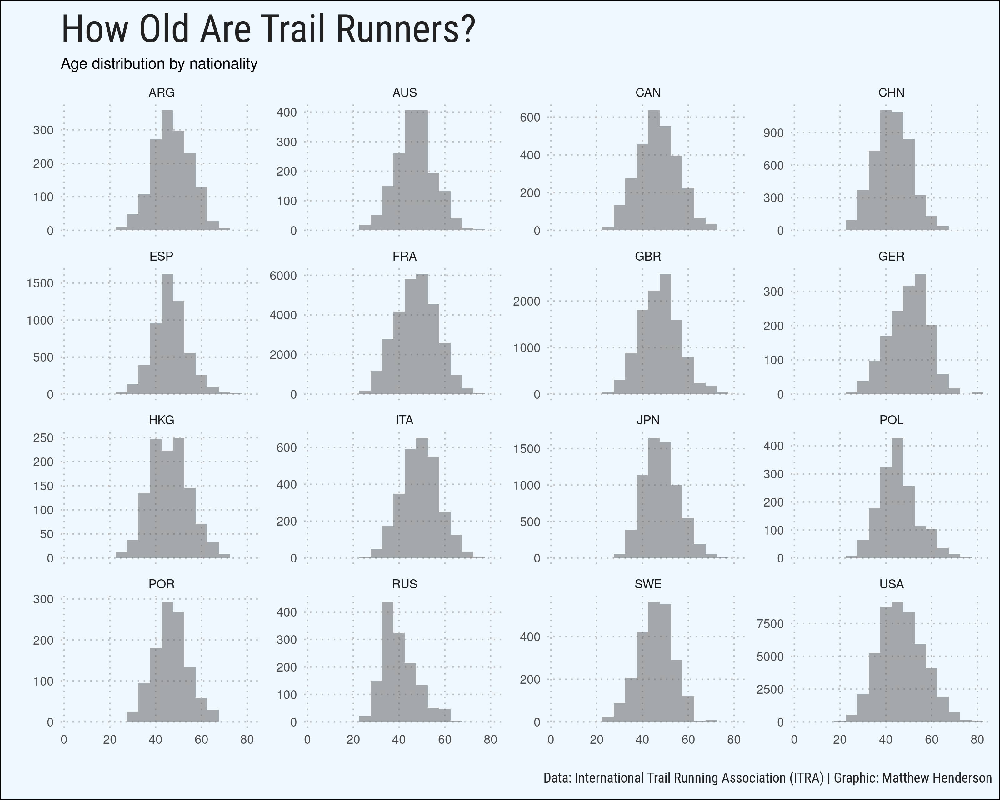
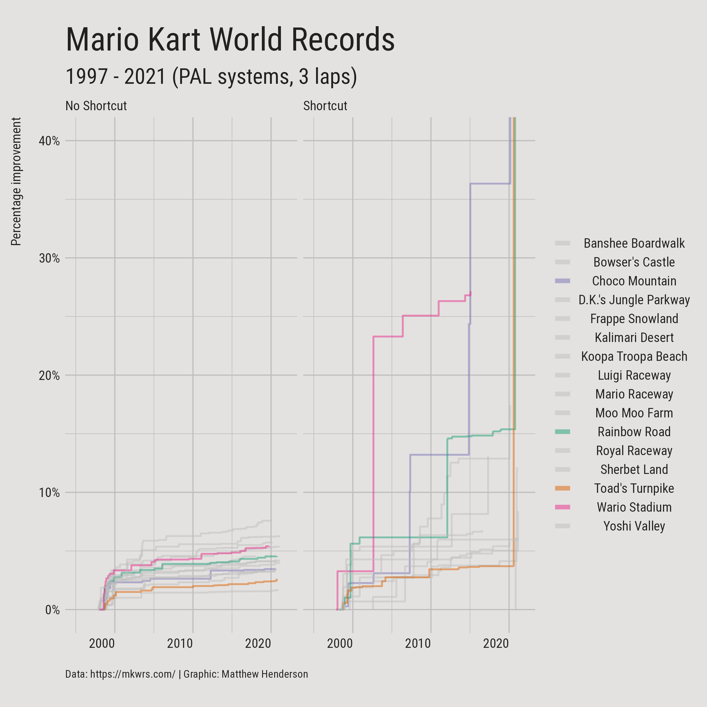
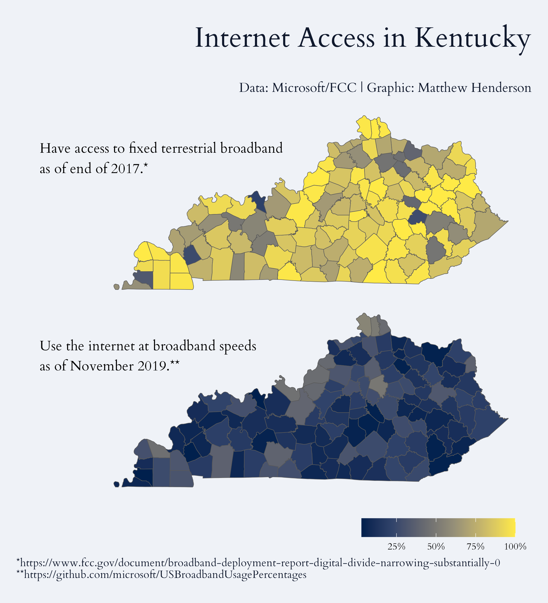
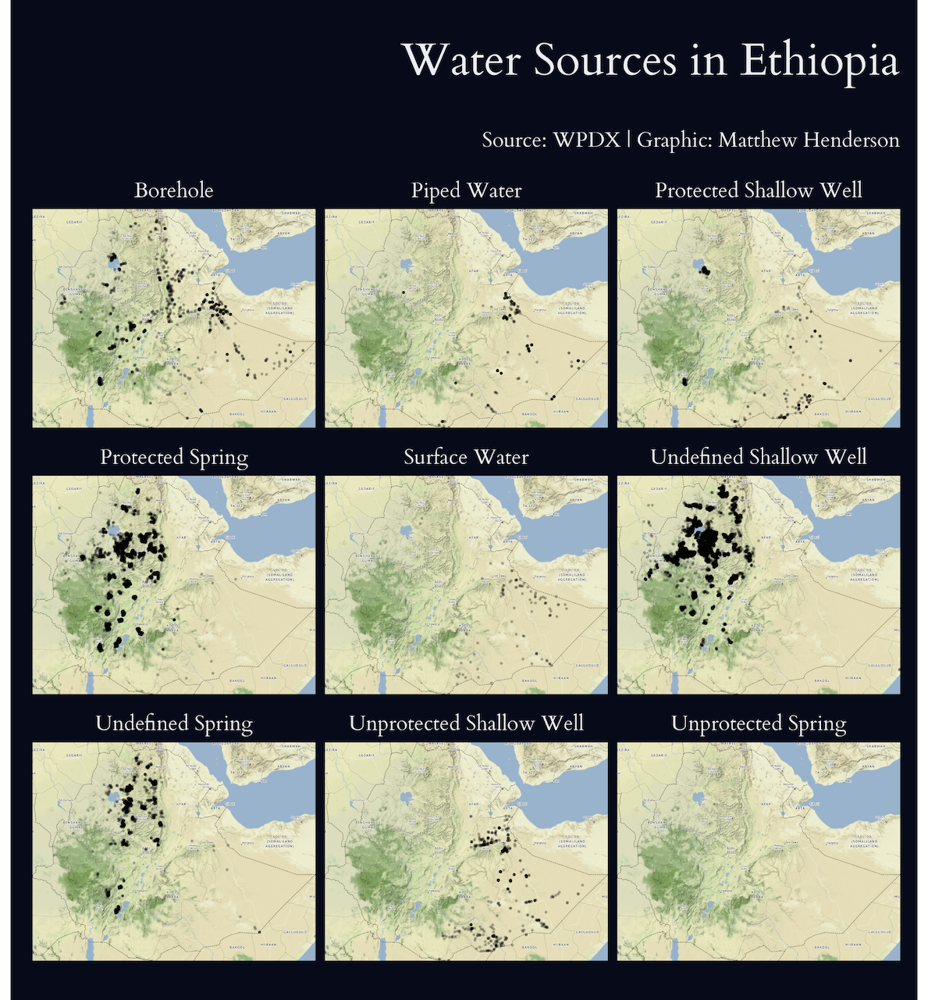
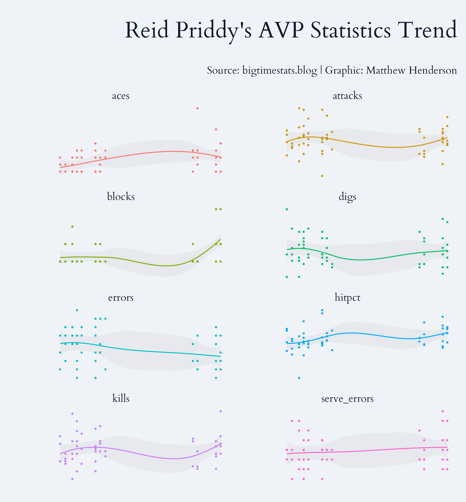
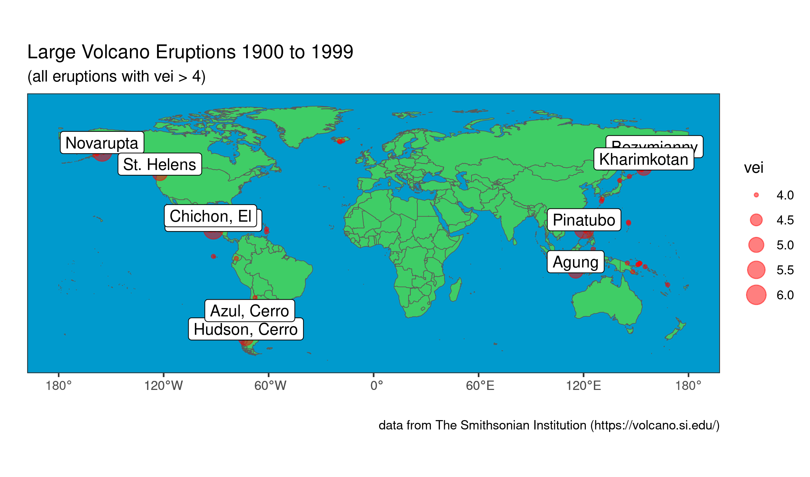
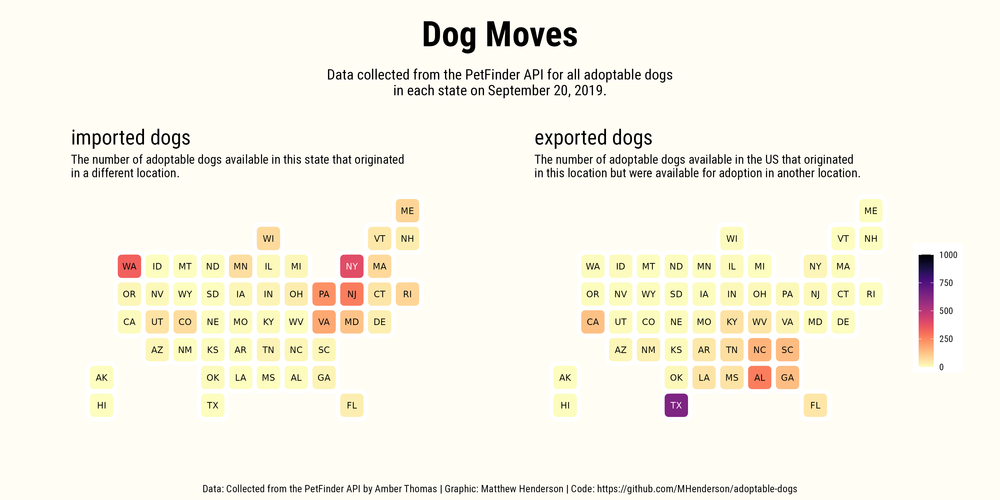
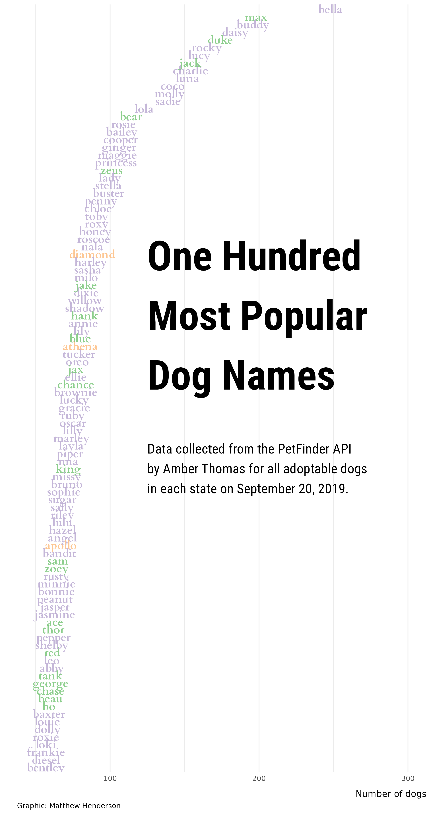
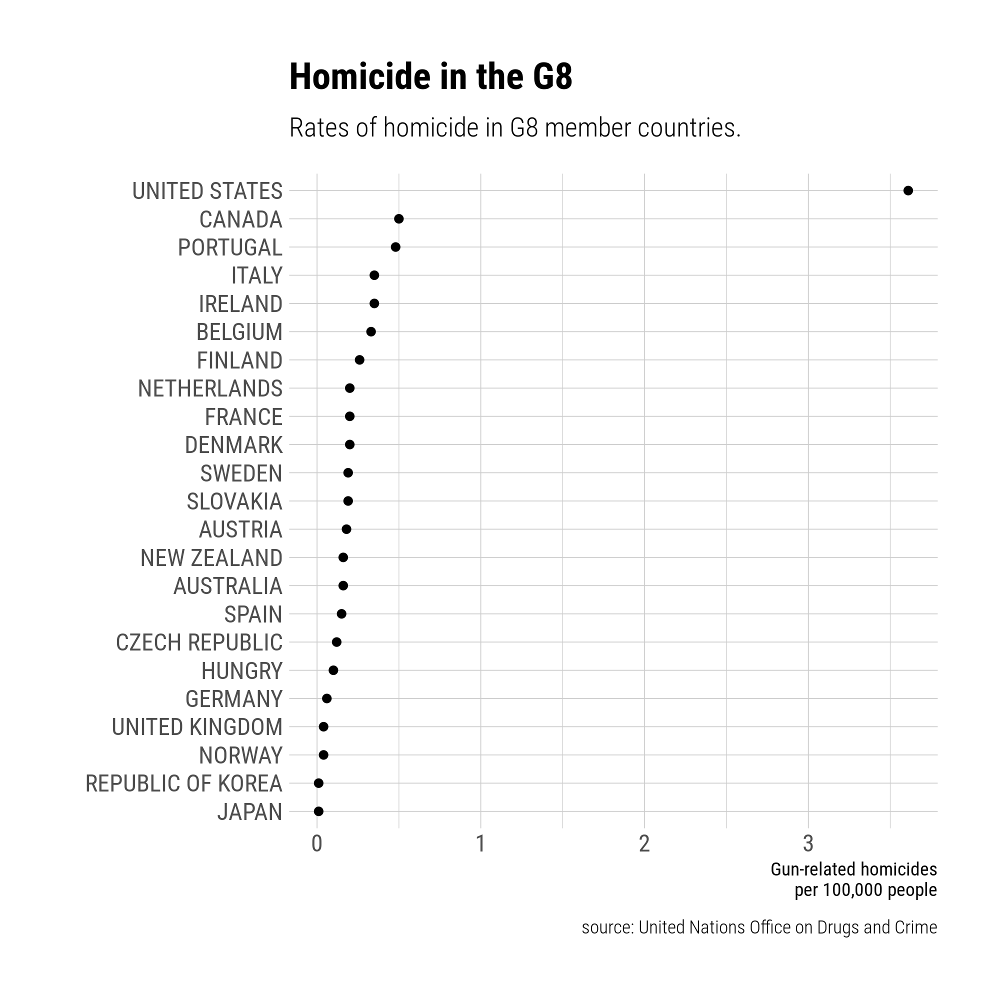
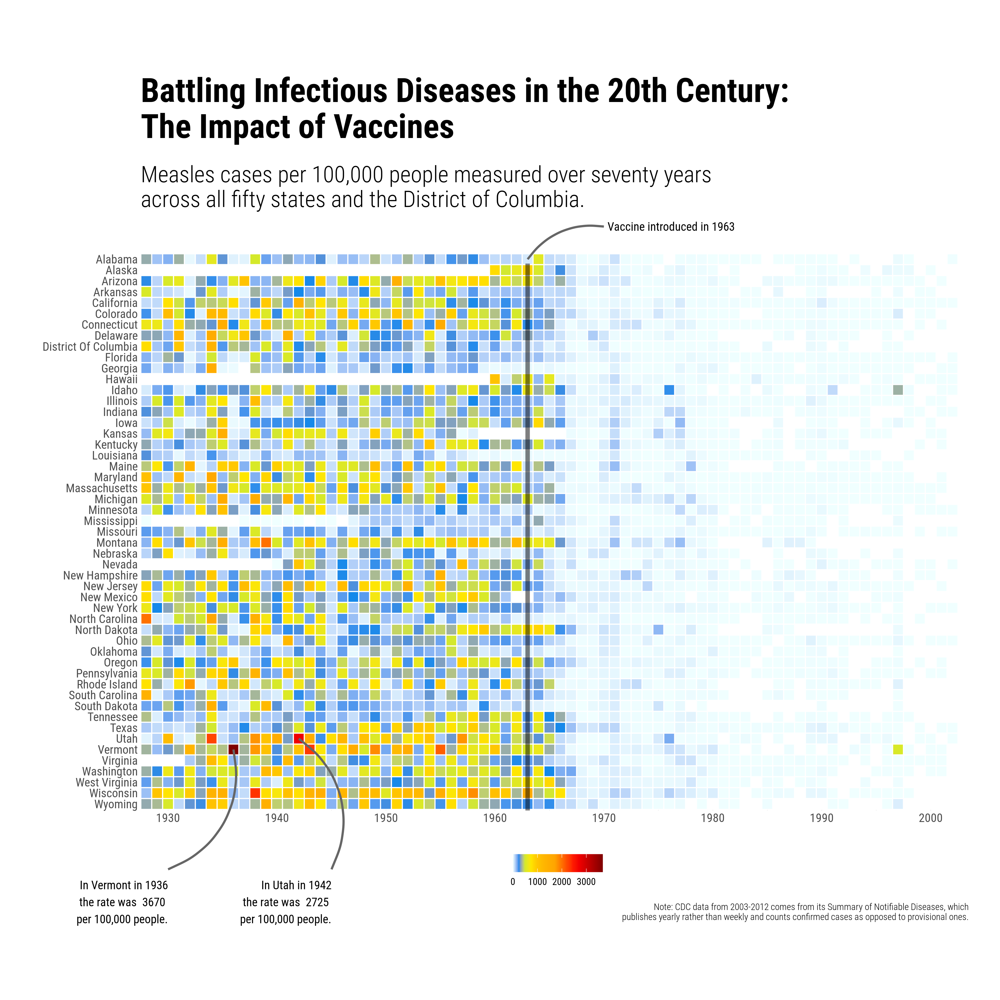

# tidy-tuesday

## 2023

## 2022

## 2021

### 44: Ultra Trail Running

Code: https://github.com/MHenderson/ultra-trail-running

### 22: Mario Kart World Records

https://github.com/MHenderson/mario-kart-records

### 20: US Broadband

Code: https://github.com/MHenderson/internet-access

### 19: Water Access Points

Code: https://github.com/MHenderson/internet-access

## 2020

### 21: Beach Volleyball

Code: https://github.com/MHenderson/beach-volleyball

### 20: Volcano Eruptions

Code: https://github.com/MHenderson/volcano-eruptions

## 2019

### 51: Adoptable Dogs

Code: https://github.com/MHenderson/adoptable-dogs

### 50: Replicating Plots in R

Code: https://github.com/MHenderson/replicating-plots-in-r

